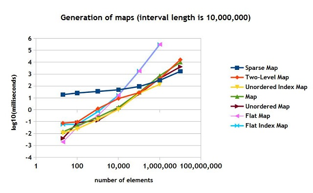
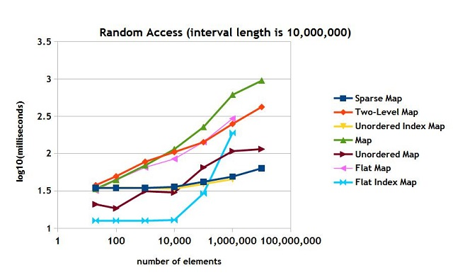
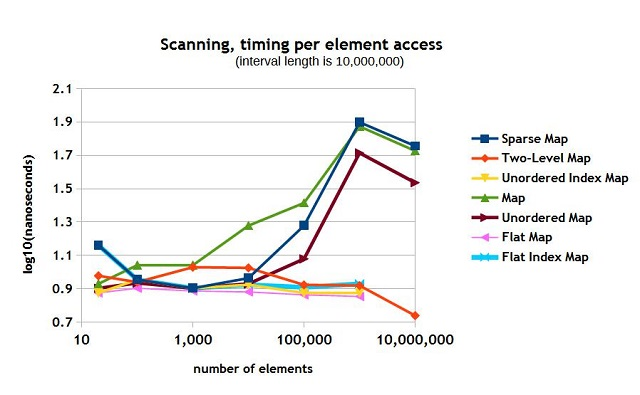
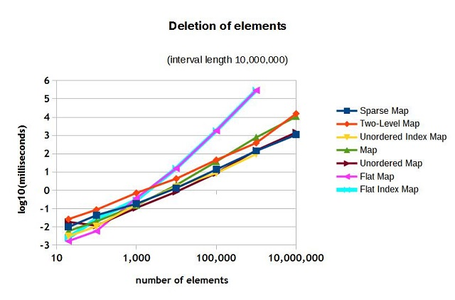
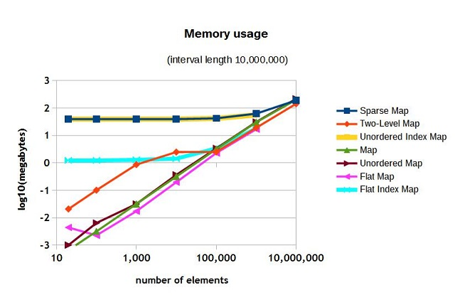

# [Fast Implementations of Maps with Integer Keys in C++](https://www.codeproject.com/Articles/866996/Fast-Implementations-of-Maps-with-Integer-Keys-in)

## Introduction

There are quite a few applications where we have to deal with sparse arrays, or maps with integer keys. When the number of elements is rather small (say, not more than a thousand), it is sufficient to use standard std::map or std::unordered_map. When the number of keys increases, those maps do not behave that well: we would like to consider faster containers. In this article, I will try to look at various approaches to implementing maps with integer keys and measure their performance.

The code was tested in Microsoft Visual C++ 14 CTP and GNU C++ 4.9.

## Is There A Problem With the Existing Map Containers?

The existing std::map and std::unordered_map spread elements all over the heap, which leads to rather inefficient access to elements (due to cache misses), especially when the number of them is approaching 100,000. It obviously depends on the size of the elements. The main two criteria of measuring efficiency can be:

* the speed of random access
* the speed of scanning through the whole list of them

The other criteria may be the speed of creation and deletion of elements. If we really want to implement efficient random access, we may as well replace the map with an array of values and use its indices as keys. This will work well if only the following two conditions are met:

* There is enough memory space to fit the whole array for the given range of key values.
* We either don't need to scan all the elements or are happy with the speed of scanning, which may not be fast if there are big gaps in values.

Another option is to use the flat map, which is not in the C++ STL, but is available in Boost [1]. (I have provided my own implementation of the flat map as well.) The flat map is a sorted array of "key-value" pairs, ordered according their keys. The advantage of the flat map that it provides the fastest way of scanning the elements in the order of their keys. It also is the most compact of all the maps. But it has the following problems:

* The random access is not that fast.
* Adding and deleting elements is rather slow when their number exceeds 100,000.

I will try to consider some other approaches and measure their performance against the known map containers.

## Proposed Map Containers

###### The Flat Index Map

This container tries to deal with some deficiencies of the flat map, by using an extra variable of type **std::vector<bool>**, which tells us whether a element with the given index is present in the flat map. This approach improves the speed of the random access, because, when checking for the presence an element, the algorithm first looks into this vector, and if the element is absent, it does not have to look any further. This saves a lot of time in case of misses, when there are lots of gaps in the map. The price you have to pay is the size of std::vector<bool>, which should be able to contain the whole range of possible indices used in the map.
  
###### The Unordered Index Map

This map is similar to the unordered sparse set discussed in [2,3,4]. The map is implemented with two arrays. One is called dense (no gaps), which contains "index-value" pairs. The other, calls sparse, contains the indices into the second array for the elements that are present. The rule is:

```
dense[sparse[i]].first = i
```

This map provides a very fast scanning facility because the nature of the dense array -- there are no gaps. The random access is rather fast as well: dense[sparse[i]] gives you the required pair. The disadvantage here is that the values of the dense array are not ordered and the map requires substantial memory space, roughly proportional to the range of the indices used in the map.

###### The Sparse Map

This is an ordered map, which is a bit similar to the unordered index map: it consists a sparse array and a dense list (of ordered pairs). The sparse array contains pointers (iterators in the implementation) to the dense list. Every time the algorithm tries to add a new element, it puts it into the right place in the dense list and sets the relevant pointer in the sparse array: the sparse array helps to make it more efficient. The advantage, in comparison to the unordered index map, is that it is ordered.

###### The Two-Level Map
The two-level map tries to solve the issue with the speed of the flat map generation by using a map-of-maps approach. In this implementation, I am using two flat maps: they are the most compact. The first-level map is a map of second-level maps. Each second-level map can have indices in the range: [0-4095]. In contrast to the flat map, this map provides a faster map generation algorithm.

## Benchmarks

###### General Comment
In these benchmarks I have been using maps, where the range of indices was fixed [0; 9,999,999]. The number of element varied: between 20 and 10,000,000. Each element consisted of an unsigned key and a double floating-point value.

This range of indices has affected the size of the memory required by some of the maps. The memory used by std::map, std::unordered_map and the flat map does depend of the possible range of the indices: it only depends on the actual elements present in the map. To some extent, this is true of the two-level map as well: but the speed, with which it grows, depends on the range. The memory usage of the other maps heavily depends on the range of possible indices.

###### Map Generation

The results are shown in Figure 1. You may see that speed of generation is particularly slow for the flat map and the flat index map. The two-level map is not the fastest, but it manages to keep it "under control". The sparse set is slow when the number of element is less than 10,000, but it starts overtaking other maps when the number grows.




###### Random Access

The results are shown in Figure 2. The "winners" here are: the sparse map, the unordered index map and std::unordered_map. The flat index map performs very well when there are lots of misses, but then starts slowing down when most of the gaps are filled. You may think that the flat index map is rather fast: it will be slow, when dealing only with the successful hits.



## Scanning Over the Whole Range of Elements

The comparison of the results are shown in Figure 3. The time taken for each scan has been divided by the number of elements: we obtained the time per element in nanoseconds. The winners here are obviously: the flat map, the flat index map and the unordered index map because the are using dense arrays of pairs for scanning. The two-level map is close as well. The sparse map, and the unordered map work reasonably well when the number of elements is less than 10,000.



## Deletion of Elements

In some way the speed of deletion, for most maps, is similar to the speed of generation. The exception is the sparse map. The results are shown in Figure 4. The biggest "losers" here are the flat map and the flat index maps, as was the case of the speed of generation.



## Memory Usage

Memory usage for the range of [0;9,999,999] is shown in Figure 5. The "loosers" here are the sparse map, the unordered index map and the flat index map.




## Conclusion

The question is: which map is the best? The answer is not that brief. If you deal with less than 1000 elements, I would not care than much. The flat map is probably the most efficient in this case and quite compact, in addition it will provide the fastest scanning algorithm. If the range is bigger, the issue is what is more important:

* If it is random access, then you may use std::unordered_map, the sparse map or the unordered index map (out of the three only the sparse map is ordered);
* If the scanning is more important, it is definitely the two-level map (the flat map is much slower in generation).

## References

* [1]. http://www.boost.org/
* [2]. Briggs, P., Torczon, L.: An efficient representation for sparse sets. ACM Letters on Programming Languages and Systems 2(1–4), 59–69 (1993)
* [3]. http://cp2013.a4cp.org/sites/default/files/uploads/trics2013_submission_3.pdf
* [4]. http://www.codeproject.com/Articles/859324/Fast-Implementations-of-Sparse-Sets-in-Cplusplus

## License

This article, along with any associated source code and files, is licensed under [The Code Project Open License (CPOL)](http://www.codeproject.com/info/cpol10.aspx)